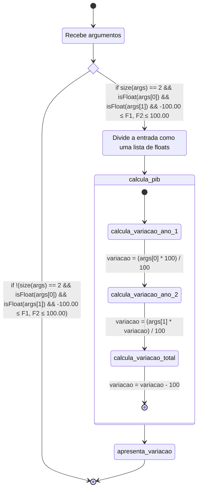

# gdp-fluctuation
GDP Fluctuation

Diagram:

```mermaid
stateDiagram-v2

RB: Recebe argumentos
state valida_entrada <<choice>>
salva_entrada: Divide a entrada como uma lista de floats
state calcula_pib {
    state calcula_variacao_ano_1
    state calcula_variacao_ano_2
    state calcula_variacao_total
    [*] --> calcula_variacao_ano_1
    calcula_variacao_ano_1 --> calcula_variacao_ano_2: variacao = (args[0] * 100) / 100
    calcula_variacao_ano_2 --> calcula_variacao_total: variacao = (args[1] * variacao) / 100
    calcula_variacao_total --> [*]: variacao = variacao - 100
}
state apresenta_variacao: apresenta variacao total do PIB

[*] --> RB
RB --> valida_entrada
valida_entrada --> salva_entrada: if size(args) == 2 && isFloat(args[0]) && isFloat(args[1]) && -100.00 ≤ F1, F2 ≤ 100.00
valida_entrada --> [*]: if !(size(args) == 2 && isFloat(args[0]) && isFloat(args[1]) && -100.00 ≤ F1, F2 ≤ 100.00)
salva_entrada --> calcula_pib
calcula_pib --> apresenta_variacao
apresenta_variacao --> [*]
```
